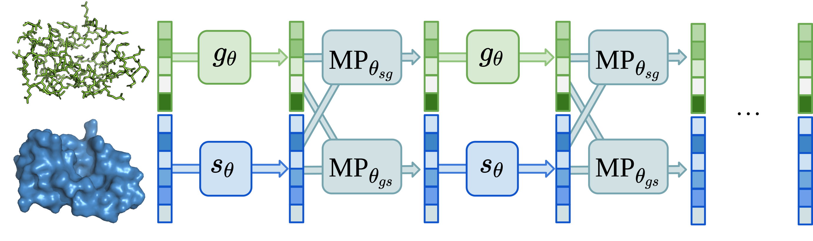

# AtomSurf

Welcome on the official implementation of AtomSurf !

:construction_worker:
This repository is still quite fresh, do not hesitate to reach out if you encounter some bugs !
:construction_worker:

## Table of Contents:

- [Description](#description)
- [Installation](#installation)
- [Tutorial](#Tutorial)
  - [Preprocessing data](#Preprocessing-data)
  - [Loading preprocessed data](#loading-preprocessed-data)
  - [Encoding a data batch](#Encoding-a-data-batch)
- [Reproducing results](#Reproducing-results)
- [Citing the tool](#Citing)

## Description

This repository is the official implementation of AtomSurf, a learnable protein structure encoder that jointly encodes
graphs and surfaces.
The corresponding paper can be found on [arxiv](https://arxiv.org/abs/2309.16519).



We provide a modular repository to preprocess pdb files into surfaces, graphs and ESM embeddings; as well as a modular
way to define models over this data.

## Installation

The first thing you will need is an environment.

```bash
conda create -n atomsurf -y
conda activate atomsurf
conda install python=3.8
```

Now let's install the torch/pyg dependencies !

For GPU support, we recommend using conda:

```bash
conda install cudatoolkit=11.7 -c nvidia
conda install pytorch=1.13 pytorch-cuda=11.7 -c pytorch -c nvidia
conda install pyg=2.3.0 pytorch-scatter pytorch-sparse pytorch-spline-conv pytorch-cluster -c pyg
pip install pyg-lib==0.4.0 -f https://data.pyg.org/whl/torch-1.13.0+cu117.html
python -c "import torch; print(torch.cuda.is_available())"
# This should return True
```

Otherwise (for cpu install), pip is simpler:

```bash
pip install torch
pip install torch_geometric==2.3.0 torch_scatter torch_sparse torch_spline_conv torch_cluster pyg_lib -f https://data.pyg.org/whl/torch-1.13.1+cpu.html
```

Finally, let's install other dependencies, in particular diffusion-net:

```bash
pip install git+https://github.com/pvnieo/diffusion-net-plus.git
pip install -r requirements.txt
```

You know have a working environment !

## Tutorial

This tutorial covers:
- how to go from a list of pdbs to preprocessed files
- how to load those files into a batch of pytorch geometric objects
- how to make a forward with our model, resulting in vector representations for each atom/residue in the graph and each vertex in the protein

The concatenated code snippets can be run as a standalone python files, going from PDBs to PyTorch tensors: 
```bash
python example.py
```

Beyond the toy reproduction presented in this tutorial, you can follow similar steps in each directory
of `atomsurf/tasks/`, though some tasks require a few extra adaptations. A relatively straightforward task is PSR.

### Preprocessing data

#### Getting the data

The first step is to produce data in a format that is compatible with our protein structure encoder.
Namely, we need to produce graphs, surfaces and esm embeddings.

To do so, we offer functions producing graphs and surfaces as pytorch geometric files from a PDB file (here for example,
`1ycr.pdb`), located in a directory `./example_data/pdb/`:

```python
import os
from atomsurf.protein.create_esm import get_esm_embedding_single
from atomsurf.utils.data_utils import pdb_to_surf, pdb_to_graphs

# Set up data paths
pdb_dir = "example_data/pdb"
surface_dir = "example_data/surfaces_0.1"
rgraph_dir = "example_data/rgraph"
esm_dir = "example_data/esm_emb"
example_name = "1ycr"

# Set up paths
pdb_path = os.path.join(pdb_dir, f"{example_name}.pdb")
surface_dump = os.path.join(surface_dir, f"{example_name}.pt")
rgraph_dump = os.path.join(rgraph_dir, f"{example_name}.pt")

# Pre-compute surface, graphs and esm embeddings
pdb_to_surf(pdb_path, surface_dump)
pdb_to_graphs(pdb_path, rgraph_dump=rgraph_dump)
get_esm_embedding_single(pdb_path, esm_dir)
```

We also offer a method to compute those files in parallel (hijacking pytorch dataloader):

```python
from atomsurf.protein.create_esm import get_esm_embedding_batch
from atomsurf.utils.data_utils import PreprocessDataset
from atomsurf.utils.python_utils import do_all

dataset = PreprocessDataset(data_dir="example_data")
do_all(dataset, num_workers=20)
get_esm_embedding_batch(in_pdbs_dir=pdb_dir, dump_dir=esm_dir)
```

This results in subdirectories `surfaces/`,`atom_graphs/`,`residue_graphs/` and `esm/` holding the data expected as
input of our method.

#### Quick peak under the hood

The code to preprocess data from PDBs is present in `atomsurf/protein/`. 
To create surfaces, we first need to produce mesh files from PDBs. 
We run MSMS as well as mesh cleaning in `create_surfaces.py`.
Then, we precompute operators in `create_operators.py`, and wrap those computations in a surface object defined in `surfaces.py`.

To create graphs, we parse pdbs to extract atomic and residue level information as arrays.
We then have a generic Graph class (`graph.py`), which mostly encompasses the Data object from PyG, and
subclass it in `atom_graph.py` and `residue_graph.py` to adapt computations.

In addition to encoding the geometry, those surfaces and graph objects are child classes FeaturesHolder, a utility class 
that handles loading named features and one-hot encoded features, and stacking them as one big feature matrix.

### Loading preprocessed data

We now expect you to have files containing surface, graphs and esm embeddings.
We provide a default loader that returns the typical input to our default network.
You can also load the data with utility classes that dynamically select which data to use.

We also provide a class `AtomBatch` to batch proteins as follows:

```python
from torch_geometric.data import Data
from atomsurf.utils.data_utils import SurfaceLoader, GraphLoader, AtomBatch
from atomsurf.utils.wrappers import DefaultLoader

# Load precomputed files
default_loader = DefaultLoader(surface_dir=surface_dir, graph_dir=rgraph_dir, embeddings_dir=esm_dir)
surface, graph = default_loader(example_name)

# Artifically group in a container and "batch"
protein = Data(surface=surface, graph=graph)
batch = AtomBatch.from_data_list([protein, protein])
print(batch)
```

### Encoding a data batch

#### Using the default encoder

We provide a function to get our default model, used throughout our published results. 
This is the quickest way to encode our protein batch.

```python
from atomsurf.utils.wrappers import get_default_model

# Instantiate a model, based on the dimensionality of the input
in_dim_surface, in_dim_graph = surface.x.shape[-1], graph.x.shape[-1]
atomsurf_model = get_default_model(in_dim_surface, in_dim_graph, model_dim=12)

# Encode your input batch !
surface, graph = atomsurf_model(graph=batch.graph, surface=batch.surface)
surface.x  # (total_n_verts, hidden_dim)
graph.x  # (total_n_nodes, hidden_dim)
print(graph.x.shape)
```

You now have trainable embeddings! 

#### Defining a custom encoder

The encoder holds many architectural choices organized as building blocks.
To go beyond our default choice and experiment with different model designs, 
we have encoded those building blocks as yaml files in `tasks/shared_conf/block_zoo*.yaml`.
Whence, to easily create a model, one should first set up a configuration file including this:

```yaml
defaults:
  - model_global_variables
  - blocks_zoo_small
  - blocks_zoo_input
  - blocks_zoo
  - encoder: pronet_gvpencoder
  - optimizer: adam
  - _self_

hydra:
  searchpath:
    - main/../../shared_conf/

# ...
```

Such a file can be parsed using hydra. This allows to instantiate models easily: 

```python
import hydra
from omegaconf import OmegaConf
from atomsurf.networks.protein_encoder import ProteinEncoder

@hydra.main(config_path="conf", config_name="config")
def main(cfg=None):
    OmegaConf.register_new_resolver("eval", eval)
    OmegaConf.resolve(cfg)
    prot_encoder = ProteinEncoder(cfg.encoder)
```

The models can be easily adapted by defining yaml blocks, without touching python code.
This allows for easy model exploration, potentially relying on hydra functionality, such as running:
`python train.py model_hdim=64` to set the hidden dimension dynamically.


Assuming we have a batch (from the above section), we can now encode our protein simply by running the following:
```python
surface, graph = prot_encoder(graph=batch.graph, surface=batch.surface)
surface.x # (total_n_verts, hidden_dim)
graph.x # (total_n_nodes, hidden_dim)
```

#### Quick peak under the hood

The two key classes are `atomsurf.network_utils.communication.surface_graph_comm.SurfaceGraphCommunication` and 
`atomsurf.networks.ProteinEncoderBlock`. In addition, many small building blocks are defined and wrapped in yaml code in
`tasks/shared_conf/block_zoo_small.yaml`.

A `SurfaceGraphCommunication` is in charge of sharing information between a graph and a surface. 
It is in charge of computing the bipartite graphs tying nodes and vertices (one in each direction). 
This computation is cached by setting this bipartite graph as a surface attribute.
It additionally holds six blocks: two pre-message, two message-passing and two post-message passing.

A `ProteinEncoderBlock` combines a surface encoder model, a graph encoder model and a `SurfaceGraphCommunication` block
to update protein representations.

## Reproducing results

To reproduce the results on each task, we have split the code in dedicated folders.

```bash
cd atomsurf/tasks/masif_ligand # choose based on your task
```

We have prepared small readmes on each task, describing the task along with instructions to get the data right.
Follow those steps to create the corresponding files in `data/`.

Then you can, simply do:

```bash
python preprocess.py
python train.py
```

And you will see the corresponding results.

## Citing

If you find our work useful, you can acknowledge it using the following citation.

```bib
@misc{mallet2024atomsurfsurfacerepresentation,
      title={AtomSurf : Surface Representation for Learning on Protein Structures}, 
      author={Vincent Mallet and Souhaib Attaiki and Yangyang Miao and Bruno Correia and Maks Ovsjanikov},
      year={2024},
      eprint={2309.16519},
      archivePrefix={arXiv},
      primaryClass={cs.LG},
      url={https://arxiv.org/abs/2309.16519}, 
}
```
